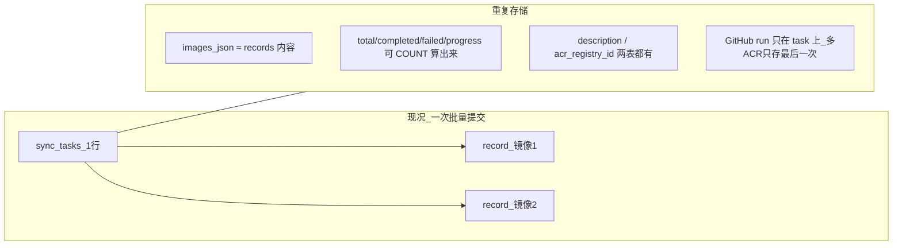
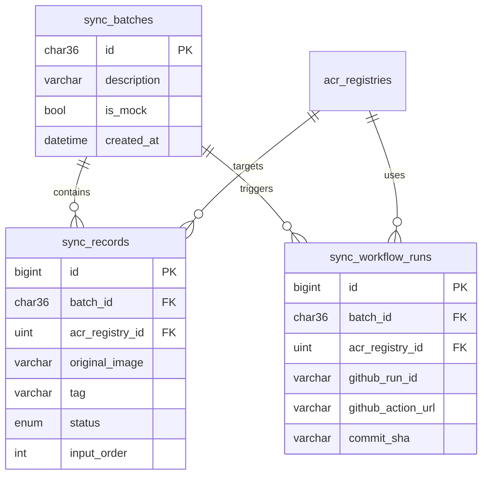

# Docker 镜像同步平台 — 新版单轨 + 表结构 redesign

## 前提（不变）

- 个人自用，**无升级/迁移**；老数据可 DROP 后用 mock 批量同步重建
- 只保留最新 API + **一份 init.sql**
- 删除全部 legacy 接口与 backfill 脚本
- **表结构定稿：3 表**（`sync_batches` + `sync_records` + `sync_workflow_runs`）

---

## 一、现况两表有什么问题？（你问的「和源 2 表有啥区别」）

### 现在的两表


| 表                    | 职责                |
| -------------------- | ----------------- |
| `sync_tasks`         | 一次提交（单条/批量）的「任务头」 |
| `image_sync_records` | 每个镜像一行            |


### 冗余与缺陷




| 问题                           | 说明                                                                                                                                                          |
| ---------------------------- | ----------------------------------------------------------------------------------------------------------------------------------------------------------- |
| **单条同步也建 task 行**            | 1 镜像 = 1 task + 1 record，task 行几乎无额外信息                                                                                                                      |
| `**images_json` 重复**         | 与 records 的 `original_input` 完全重复（`[sync.go:195](internal/handlers/sync.go)`）                                                                               |
| **进度字段可计算**                  | `total_images/completed_images/failed_images/progress` 在 `GetSyncStatus` 里已从 records **再数一遍**（`[sync.go:476-487](internal/handlers/sync.go)`），task 上存的是冗余副本 |
| **任务级 `acr_registry_id` 不准** | 多镜像批量会按亲和性分到不同 ACR（`[autoResolveAcr](internal/handlers/sync.go)`），task 上的 ID 无意义                                                                            |
| **GitHub Run 丢失**            | 多 ACR 会触发多次 workflow，但 task 只存 **最后一次** run（`[lastRunID, lastRunURL](internal/handlers/sync.go:804-828)`）                                                   |
| **废弃字段占表**                   | `auto_retry/current_retry/paused` 等从未真正跑通                                                                                                                   |
| **record 侧也有死字段**            | `priority/max_retries/image_size/retrying/skipped` 几乎不用                                                                                                     |


**结论：`sync_tasks` 与 `image_sync_records` 不是「主从清晰的两层」，而是早期把「批次元数据 + 镜像明细 + GitHub 状态 + 可聚合统计」全堆在两个表里，边界模糊、字段重复，多 ACR 下还有数据准确性问题。**

---

## 二、推荐新 schema（3 表，替代原 2 表）

### 和「源 2 表 / 极简 2 表」的对比


| 维度          | 源 2 表（现况）                       | 极简 2 表                                 | **推荐 3 表**                                           |
| ----------- | ------------------------------- | -------------------------------------- | ---------------------------------------------------- |
| 表           | sync_tasks + image_sync_records | sync_records + sync_workflow_runs      | **sync_batches + sync_records + sync_workflow_runs** |
| 批次元数据       | 臃肿的 sync_tasks（含大量可算字段）         | 写在每条 record 上（description/mock 重复 N 次） | **sync_batches 仅 4~5 个字段**                           |
| 镜像明细        | image_sync_records              | sync_records（精简列）                      | sync_records（精简列）                                    |
| GitHub Run  | 只在 task 上，多 ACR 丢数据             | sync_workflow_runs                     | sync_workflow_runs                                   |
| 单条同步        | task + record 两行                | record 一行（带 batch_id）                  | batch 头 1 行 + record 1 行（batch 极轻）                   |
| history API | 查 sync_tasks                    | GROUP BY batch_id                      | 查 sync_batches + 聚合                                  |


**推荐 3 表的理由：**

- 比现况少 **一整张冗余宽表**（sync_tasks 整表删除）
- 比极简 2 表多一张 **极小的 batch 头表**，避免 batch 描述 / mock 标记在 N 条 record 上重复，history 查询也更干净
- `sync_workflow_runs` 专门解决 **「一个批次 × 多个 ACR = 多个 GitHub Run」**，这是现况 task 表做不到的

### ER 关系




### 表定义（init.sql 目标）

#### init.sql 注释规范（必须遵守）

实现 `[scripts/init.sql](scripts/init.sql)` 时：

1. **文件头**：说明用途、适用 MySQL 版本、执行方式（`DROP` 重建、无升级）
2. **每张表**：`CREATE TABLE` 使用 `COMMENT='...'` 写表级中文说明
3. **每个字段**：使用列级 `COMMENT '...'`，说明：
  - 字段业务含义
  - 关键取值（enum / 0 的含义 / 是否可空）
  - 与其他表的关系（如 FK 语义，即使未建物理外键也要注明）
4. **索引 / 唯一约束**：在字段 COMMENT 或表后单独 `--` 块说明为何建索引
5. **RBAC seed 段**：`INSERT` 前用 `--` 块说明 seed 内容与默认管理员来源

MySQL 列注释示例（实现时所有表均按此风格写全）：

```sql
CREATE TABLE sync_records (
  id              BIGINT UNSIGNED NOT NULL AUTO_INCREMENT
    COMMENT '主键',
  batch_id        CHAR(36) NOT NULL
    COMMENT '所属批次 UUID，关联 sync_batches.id；API 对外亦称 task_id',
  acr_registry_id INT UNSIGNED NOT NULL
    COMMENT '目标 ACR 实例 ID，关联 acr_registries.id；入库前必须已解析，不允许 0',
  original_image  VARCHAR(500) NOT NULL
    COMMENT '源镜像仓库路径（不含 tag），如 nginx 或 gcr.io/xxx/yyy',
  tag             VARCHAR(100) NOT NULL DEFAULT 'latest'
    COMMENT '镜像 tag',
  status          ENUM('pending','syncing','success','failed') NOT NULL DEFAULT 'pending'
    COMMENT '单镜像同步状态；批次总状态由本表聚合计算，不单独存',
  -- ... 其余字段同样逐列 COMMENT ...
  PRIMARY KEY (id),
  KEY idx_batch_id (batch_id),
  KEY idx_status (status)
) ENGINE=InnoDB DEFAULT CHARSET=utf8mb4
  COMMENT='镜像同步明细：每个待同步/已同步镜像一行，SyncView 列表主数据源';
```

**验收标准：** 任意一张表在 MySQL 中执行 `SHOW FULL COLUMNS FROM <table>` 时，每列 `Comment` 均非空且为中文业务说明。

#### 1. `sync_batches` — 替代 `sync_tasks`（极瘦）


| 列                           | 说明                                          |
| --------------------------- | ------------------------------------------- |
| `id`                        | UUID，对外 API 仍叫 `task_id` / `batch_id`（兼容前端） |
| `description`               | 用户备注，**只存一份**                               |
| `is_mock`                   | 是否模拟同步（替代 mock 专用逻辑分支里对 task 的隐式假设）         |
| `created_at` / `updated_at` | 时间戳                                         |


**删除的概念（不再建列）：** status、progress、total/completed/failed、images_json、auto_retry、max_concurrent、acr_registry_id、github_*、error_message、started_at/completed_at

**批次 status / 进度：** 查询时从 `sync_records` 聚合：

```sql
-- 伪代码
-- running:  存在 syncing
-- failed:   全部终态且存在 failed
-- completed: 全部 success
-- partial_success: 有 success 也有 failed
-- pending:  全部 pending
```

#### 2. `sync_records` — 替代 `image_sync_records`（精简）


| 保留列                                             | 删除列                         |
| ----------------------------------------------- | --------------------------- |
| id, batch_id, acr_registry_id **NOT NULL**      | task_id → 改名 batch_id       |
| original_image, tag, architecture               | priority, max_retries       |
| acr_image, acr_architectures                    | retrying/skipped 状态         |
| original_input, input_order                     |                             |
| status: **pending/syncing/success/failed**（4 态） |                             |
| error_message, description（可选，单镜像时可用）           |                             |
| retry_count, started_at, completed_at, duration | image_size（可选保留，以后从 ACR 回填） |
| created_at, updated_at, deleted_at              |                             |


**重试策略：** 仅 `config.yaml` 的 `sync.max_retry_count`；不在行上存 max_retries。

**JSON 兼容（定稿）：** 数据库列名 `status`；对外 API / 前端仍用 **`sync_status`**（与现网 GORM `json:"sync_status"` 一致），Swagger 与 `web/src/utils/status.js` 同步；筛选参数 `?status=` 可保留。

#### 3. `sync_workflow_runs` — **新增**（现况完全缺失）


| 列                                            | 说明                              |
| -------------------------------------------- | ------------------------------- |
| batch_id + acr_registry_id                   | 联合唯一：一个批次在同一 ACR 上触发一次 workflow |
| github_run_id, github_action_url, commit_sha | 监控与跳转链接                         |
| created_at                                   |                                 |


`[monitorGitHubActions](internal/handlers/sync.go)` 改为按 **workflow_run 行** 监控，而不是 task 上那一个 run_id。

### init.sql 完整表清单（greenfield 全库，非仅 3 张同步表）

| 分类 | 表 |
|------|-----|
| 同步（新） | `sync_batches`、`sync_records`、`sync_workflow_runs` |
| ACR | `acr_registries`、`acr_repositories` |
| RBAC | `permissions`、`roles`、`role_permissions`、`users`、`login_logs` |
| 配置 | `system_configs`（**仅 Git 等**，禁止 seed `aliyun_*`） |

实现顺序建议：RBAC → ACR → 同步三表 → seed（角色权限 + 默认管理员 + 可选首条 ACR 自 `config.yaml` bootstrap）。

### 不需要动的表（概念保留，DDL 写入 init.sql）


| 表                          | 原因                                                                       |
| -------------------------- | ------------------------------------------------------------------------ |
| `acr_registries`           | ACR 凭据唯一来源                                                               |
| `acr_repositories`         | **镜像台账**（ACR 里有哪些 repo），与 sync_records **不重复** — 前者是库存/catalog，后者是同步操作日志 |
| RBAC / system_configs（Git） | 继续保留                                                                     |


---

## 三、API 层变化（路径尽量不变，响应见契约）

### 3.1 路由一览

| API                                                  | 变化                                                                 |
| ---------------------------------------------------- | ------------------------------------------------------------------ |
| `POST /sync/submit`、`/sync/batch`、`/sync/batch/mock` | 创建 `sync_batches` + N 条 `sync_records`；真实同步再写 `sync_workflow_runs` |
| `GET /sync/status/:taskId`                           | 见 **3.2** 响应契约；参数名 `taskId` 保留（= `sync_batches.id`）                    |
| `GET /sync/history`                                  | 改查 `sync_batches` + 聚合（前端未用，可保留供 health-check）                      |
| `GET /images/list` 等                                 | 数据源 `sync_records`；**left join** `sync_workflow_runs` 填 `github_run_id` / `github_run_url`（见 3.3） |
| `POST /images/:id/retry`                             | 新建 batch（1 条 record）+ **共用 sync service 触发 processSync**（禁止只改 pending） |
| `POST /acr-registries/test`                          | **新增**，迁移原 `POST /config/aliyun/test` 连接测试逻辑                         |

**删除：** `GET /sync/batch/status`、`/config/aliyun-db`、`/config/aliyun/test`、所有 `sync_tasks` 相关代码。

### 3.2 `GET /sync/status/:taskId` 响应契约（定稿）

| 字段 | 来源 |
|------|------|
| `task_id` | `sync_batches.id` |
| `status` / `progress` / `total_images` / `completed_images` / `failed_images` | 从 `sync_records` **聚合**，不读 batch 冗余列 |
| `description` / `is_mock` / `created_at` | `sync_batches` |
| `workflow_runs` | **新增数组**：`[{ acr_registry_id, github_run_id, github_action_url, commit_sha }]` |
| `images.pending/syncing/success/failed` | 计数 + `records` 列表（含 `sync_status`） |

前端 [`SyncView.vue`](web/src/views/SyncView.vue) 轮询改为 **仅** `getSyncStatus`；批次级可展示多个 GitHub Run（按 ACR 分组或列表）。

### 3.3 `GET /images/list` 与行级 GitHub 链接（方案 A，定稿）

现网 record **无** `github_run_*`，UI 按钮几乎不显示。重构后：

- 按 `batch_id + acr_registry_id` left join `sync_workflow_runs`
- 在列表/详情 JSON 中填充 `github_run_id`、`github_run_url`（兼容现有 SyncView 列）

不采用「仅批次区展示、删行级按钮」方案 B，避免大改 SyncView 表格列。

### 3.4 请求 DTO 精简

| 删除字段 | 说明 |
|----------|------|
| `BatchSyncRequest.auto_retry` / `retry_count` | 重试仅服务端 `config.yaml` `sync.max_retry_count` |
| `ImageSyncItem.priority` | 与 DB 删除 priority 一致 |
| `ImageRequest` 类型 | 未使用，删除 |

保留：`max_concurrent`（0 或未传时由 `config.yaml` `sync.max_concurrent_jobs` 填充）；`acr_registry_id:0` 仍表示后端亲和性解析。

---

## 四、Legacy 清理（与表 redesign 一并做）

- 删 [`scripts/backfill_acr_registry_id.sql`](scripts/backfill_acr_registry_id.sql)、[`internal/database/migrations.go`](internal/database/migrations.go)
- 删 `/config/aliyun-db`、`/config/aliyun/test`；[`internal/services/config.go`](internal/services/config.go) `GetAliyunConfig` / `SetAliyunConfig`
- 删 [`web/src/views/ImagesView.vue`](web/src/views/ImagesView.vue)（路由已指向 `ImagesManageView`）
- 删 [`web/src/api/index.js`](web/src/api/index.js) 中 `getAliyunConfig`、`updateAliyunConfig`、`testAliyunConnection`、`getBatchSyncStatus`；`getSyncHistory` 若无调用一并删
- **ConfigView：仅删 `system` Tab**（无后端持久化的占位表单）
- **保留并重命名 ACR UI**：[`AliyunConfigForm.vue`](web/src/components/AliyunConfigForm.vue) 已走 `acrRegistryAPI`，**不得删除** → 重命名为 `AcrRegistryConfigForm.vue`，Tab 文案「阿里云配置」→「**ACR 配置**」
- 删 `BatchSyncForm` / 请求体中的 `auto_retry` 等（见 3.4）
- ACR 鉴权统一 `acr_registries`：**删除** [`sync.go`](internal/handlers/sync.go) `buildAcrWorkflowInputs` 内对 `system_configs` `aliyun_*` 的回退；[`image.go`](internal/handlers/image.go) 删除 `utils.GenerateACRImage` 在 `acr_registry_id` 缺失时的回退

---

## 五、真实 Bug（表改完后仍要修）


| Bug | 做法 |
|-----|------|
| 批量轮询调 410 接口 | SyncView **始终** `getSyncStatus`（[`sync.js:591`](web/src/views/SyncView.vue) 现调 `getBatchSyncStatus`） |
| 重试不触发同步 | [`image.go` RetrySync](internal/handlers/image.go) 现仅改 `pending`；改为新建 `sync_batches` + 1 条 `sync_records` 并触发同步 |

**重试实现路径（避免 handler 循环依赖）：**

- 新增 `internal/services/sync_batch.go`（或等价）：`CreateRetryBatch(recordID) (batchID, error)` + `StartProcessing(batchID)`
- `SyncHandler.processSyncTask` 与 `ImageHandler.RetrySync` **共用**该 service
- 禁止在 RetrySync 里只 `Updates(sync_status: pending)` 而不走 Git 提交 / GitHub 监控

---

## 六、建议增强（非必须）

- BatchSyncForm 接入 `check-acr`（API 已有，见 todo `check-acr-ui`）
- `POST /acr-registries/test` + [`AcrRegistryDialog.vue`](web/src/components/AcrRegistryDialog.vue) 连接测试（与 todo `acr-registry-test-api` 合并实施）
- 路由守卫权限不足时 `ElMessage` 提示（现静默跳转 `/sync`）

---

## 七、明确不做

- 升级 SQL / backfill / 兼容旧 task_id 数据
- 恢复 sync_tasks 或 AutoRetry 调度
- Dashboard / 通知 / 导出（README 删掉导出描述即可）
- paused/skipped 任务 API

---

## 八、执行顺序

```mermaid
flowchart LR
  subgraph s1 [阶段1_表设计与init.sql]
    A1[三表DDL含字段COMMENT]
    A2[init.sql]
    A3[删误导文档与backfill]
  end
  subgraph s2 [阶段2_后端]
    B1[models + sync.go 重写]
    B2[image/acr_affinity/utils]
    B3[删legacy API与sync_tasks]
    B4[deploy compose去ALIYUN应用配置]
  end
  subgraph s3 [阶段3_前端]
    C1[SyncView轮询与多Run展示]
    C2[删ImagesView与dead API]
    C3[ConfigView删systemTab_ACR Tab改名]
    C4[BatchSyncForm与AcrRegistryDialog]
  end
  subgraph s4 [阶段4_文档收尾_必做]
    D1[更新全部有效文档]
    D2[Swagger与e2e指南]
    D3[scripts与Makefile]
  end
  s1 --> s2 --> s3 --> s4
```




**你的部署流：**

```text
DROP DATABASE docker_sync;
mysql < scripts/init.sql
→ 启动服务 → 配置 Git → UI 添加默认 ACR
→ POST /sync/batch/mock 重建数据
```

---

## 九、文档清理清单（删除，避免误导）

以下文档 **已完成历史使命** 或 **与新版架构矛盾**，重构时 **直接删除**，不保留 archive。


| 文件/目录                                                                          | 删除原因                                            |
| ------------------------------------------------------------------------------ | ----------------------------------------------- |
| `[plan-20260402.md](plan-20260402.md)`                                         | P0–P2 已完成；P3 仍围绕已废弃 ImagesView / 旧架构            |
| `[plan-login-20260402.md](plan-login-20260402.md)`                             | 登录功能已完成；模型描述过时（`Role` 字符串 vs 现 `role_id`）       |
| `[plan-role-20260403.md](plan-role-20260403.md)`                               | RBAC 已完成；权限矩阵缺 `images`/`roles`，与现网不符           |
| `[docs/superpowers/plans/](docs/superpowers/plans/)`                           | 多 ACR / ACR 台账 **实施 checklist**，已全部落地           |
| `[docs/superpowers/specs/](docs/superpowers/specs/)`                           | 含 §8 迁移/backfill/双轨 aliyun 设计，与 greenfield 单轨冲突 |
| `[scripts/backfill_acr_registry_id.sql](scripts/backfill_acr_registry_id.sql)` | 升级回填脚本，明确不需要                                    |


**保留的文档（重构后必须更新内容，不删文件）：**


| 文件                                                                                               | 更新要点                                                           |
| ------------------------------------------------------------------------------------------------ | -------------------------------------------------------------- |
| `[README.md](README.md)`                                                                         | 删「数据导出」、`.env.example`；加 init.sql 部署；新表结构；ACR 在 UI 配置          |
| `[CLAUDE.md](CLAUDE.md)`                                                                         | 三表 + init.sql；Config 页 **ACR Tab**（非 aliyun-db）；删 sync_tasks/ImagesView/aliyun-db API |
| `[docs/README.md](docs/README.md)`                                                               | 索引与现目录一致；去掉不存在的文档链接                                            |
| `[docs/SWAGGER使用说明.md](docs/SWAGGER使用说明.md)`                                                     | 删 aliyun-db、batch/status；补 ACR/RBAC/三表相关 API                   |
| `[docs/swagger.json](docs/swagger.json)`                                                         | 与 `main.go` 路由 **完全一致**（单一事实来源）                                |
| `[docs/e2e-test-guide.md](docs/e2e-test-guide.md)`                                               | T4→SyncView；T6→Config **ACR 配置** Tab（非 aliyun-db 四字段）；**删 T7 系统设置**；补镜像管理/Tag（可选） |
| `[deploy/docker-all/README.md](deploy/docker-all/README.md)`                                     | init.sql 初始化；ACR 走 Web 非 env；删误导 ALIYUN 应用配置说明                 |
| `[scripts/README.md](scripts/README.md)`                                                         | 增加 init.sql 用法；health-check 检查项更新                              |
| `[config.yaml.example](config.yaml.example)`                                                     | `aliyun:` 段改为「可选：仅首次空库 bootstrap 写入 acr_registries，非常驻配置」或删除   |
| `[.claude/dev-server.md](.claude/dev-server.md)`                                                 | 补充「首次需 init.sql」一句                                             |
| `[.cursor/skills/docker-image-sync-acr/SKILL.md](.cursor/skills/docker-image-sync-acr/SKILL.md)` | 已正确标注 batch/status 410；补充 ACR 需先在 UI 配置                        |


**可选：** 为 `deploy/docker-signal/` 新增简短 `README.md`（目前无文档，compose 易误导）。

---

## 十、代码/配置审查遗漏项（原计划未写全）

经与现网代码对照，以下内容 **必须纳入重构**，否则文档更新了行为仍不一致：

### 10.1 数据库与启动


| 遗漏项                              | 位置                                                                                                  | 处理                                                                             |
| -------------------------------- | --------------------------------------------------------------------------------------------------- | ------------------------------------------------------------------------------ |
| GORM AutoMigrate 与 init.sql 双轨   | `[database.go](internal/database/database.go)` + `[migrations.go](internal/database/migrations.go)` | **init.sql 为唯一 schema 来源**；AutoMigrate 仅保留 RBAC seed 或 dev 模式可选，避免 silently 改表 |
| `initDefaultConfigs` seed aliyun_* | `[database.go](internal/database/database.go)` `initDefaultConfigs`                                  | 删除 aliyun_*；Git seed 保留；可选 `config.yaml` `aliyun:` 首次空库写入一条 `acr_registries` |
| `ensureUserRoleIDColumn` 等 RBAC 升级链 | `[database.go](internal/database/database.go)`                                                      | greenfield 下 **删除**（init.sql 已含 `users.role_id`）                                |
| `MigrateEncryptionKeys`          | `[database.go](internal/database/database.go)`                                                      | 保留（与 ACR 密码加密相关）                                                               |


### 10.2 后端未覆盖文件


| 文件                                                                                             | 处理                                                                       |
| ---------------------------------------------------------------------------------------------- | ------------------------------------------------------------------------ |
| `[internal/utils/acr.go](internal/utils/acr.go)`                                               | 确认 [`acr_registry.go`](internal/utils/acr_registry.go) 覆盖后删除；去掉读 system_configs |
| `[internal/services/config.go](internal/services/config.go)` `GetAliyunConfig` / `SetAliyunConfig` | 删除                                                                       |
| `[internal/handlers/config.go](internal/handlers/config.go)`                                 | 删 Get/UpdateAliyunConfig、TestAliyunConnection；`GetConfigStatus`/`GetAllConfigs` 去掉 aliyun 块 |
| `[internal/handlers/sync.go](internal/handlers/sync.go)` `buildAcrWorkflowInputs`            | 删除对 `system_configs` `aliyun_*` 回退；`acr_registry_id` 无效则失败                      |
| `[internal/handlers/image.go](internal/handlers/image.go)`                                     | 改查 `sync_records`；删 `GenerateACRImage` 回退；RetrySync 走 sync_batch service          |
| `[internal/services/sync_batch.go](internal/services/sync_batch.go)`                         | **新增**：创建 batch、触发 processSync，供 sync/image handler 共用                         |
| `[internal/models/models.go](internal/models/models.go)`                                       | 删 `SyncTask`、`BatchTaskStatusResponse`、`ImageRequest`；新增三表模型；DTO 见 3.4          |
| `[internal/config/config.go](internal/config/config.go)` `AliyunConfig`                        | 改为可选 bootstrap 或删除段；与 `config.yaml.example` 一致                                  |
| `[internal/services/acr_repository.go](internal/services/acr_repository.go)` `SyncFromRecords` | 改查 `sync_records`                                                        |
| `[internal/services/acr_affinity.go](internal/services/acr_affinity.go)`                       | 改查 `sync_records`                                                        |
| `[internal/services/github_test.go](internal/services/github_test.go)`                         | **保留** workflow input 键名 `aliyun_registry`（GitHub Actions 参数名，非 DB 配置）   |
| `[main.go](main.go)`                                                                           | 删 batch/status、aliyun-db 路由；注释更新                                         |


### 10.3 前端未覆盖文件


| 文件                                                                             | 处理                                                |
| ------------------------------------------------------------------------------ | ------------------------------------------------- |
| `[web/src/stores/sync.js](web/src/stores/sync.js)`                             | 删 `getBatchSyncStatus`；删未使用的 `loadSyncHistory`     |
| `[web/src/stores/image.js](web/src/stores/image.js)`                           | 随列表 enrich 字段与四态筛选更新                            |
| `[web/src/utils/status.js](web/src/utils/status.js)`                           | 状态映射对齐 4 态（去掉 retrying/skipped）                  |
| `[web/src/components/BatchSyncForm.vue](web/src/components/BatchSyncForm.vue)` | 去 `auto_retry`；接入 `check-acr`；多镜像 `acr_registry_id:0` 保留 |
| `[web/src/components/SingleSyncForm.vue](web/src/components/SingleSyncForm.vue)` | 提交字段与新版 DTO 一致                                  |
| `[web/src/components/AliyunConfigForm.vue`](web/src/components/AliyunConfigForm.vue) | **重命名** `AcrRegistryConfigForm.vue`，仅改 import/Tab 引用 |
| `[web/src/components/AcrRegistryDialog.vue`](web/src/components/AcrRegistryDialog.vue) | 增加「测试连接」调用 `POST /acr-registries/test`              |
| [`web/src/views/ConfigView.vue`](web/src/views/ConfigView.vue) | 删 `system` Tab；Tab「ACR 配置」；组件改名为 `AcrRegistryConfigForm` |
| `[web/src/router/index.js](web/src/router/index.js)`                           | 权限不足时可选 `ElMessage.warning`                        |
| `[internal/services/acr_repository_test.go](internal/services/acr_repository_test.go)` | 若引用旧表名则更新                                      |


### 10.4 部署与脚本（文档外但易遗漏）


| 文件                                                                  | 问题                                     | 处理                                                               |
| ------------------------------------------------------------------- | -------------------------------------- | ---------------------------------------------------------------- |
| `[deploy/docker-all/docker-compose*.yml](deploy/docker-all/)`       | 仍注入 `ALIYUN`_* 给应用                     | 从 **应用容器 env** 移除；ACR 仅 DB+UI（Makefile 里 push 镜像用的 ALIYUN 变量可保留） |
| `[deploy/docker-signal/docker-compose*.yml](deploy/docker-signal/)` | 同上                                     | 同上                                                               |
| `[deploy/*/env-example](deploy/)`                                   | 仍写 ALIYUN 为应用必填                        | 改为注释说明「可选 bootstrap」或删除应用侧 ALIYUN 段；**勿提交真实密码占位**              |
| `[deploy/*/docker-compose*.yml](deploy/)`                           | 默认 `ENCRYPTION_KEY`/`ALIYUN_PASSWORD` 明文 | 应用容器去掉 `ALIYUN_*`；env 改用占位符说明                                    |
| `[scripts/health-check.sh](scripts/health-check.sh)`                | 检查 sync/history 等                      | 若保留 `/sync/history` 则只更新注释；删 history 则改检查项                         |
| `[Makefile](Makefile)` `init` 目标                                    | 仍提示编辑 `.env`                           | 改为 `config.yaml` + `init.sql` 指引                                 |
| `[Makefile](Makefile)` `.PHONY`                                     | 声明了 `docker-build`/`docker-run` 等无实现目标 | 删除虚假 target 或补实现（建议删）                                            |


### 10.5 重要区分（避免 refactor 误删）

- **GitHub Actions workflow inputs** 里的 `aliyun_registry`、`aliyun_namespace` 等键名 — 这是 **传给 GitHub 工作流的参数名**，与 DB 表无关，**必须保留**（见 `[buildAcrWorkflowInputs](internal/handlers/sync.go)`）；值 **只** 来自 `acr_registries`，不得再读 `system_configs`。
- **deploy Makefile 的 ALIYUN_REGISTRY** — 用于 **docker push 到 ACR**，不是应用运行时配置，与 `acr_registries` 表无关，可保留。
- **`AliyunConfigForm.vue`** — 文件名误导，实质是 **ACR 实例管理 UI**（已用 `acrRegistryAPI`），**禁止与 aliyun-db 一并删除**；见第四节。

---

## 十一、文档更新验收标准（阶段 4 完成标志）

重构 **代码全部改完后**，按此 checklist 验收文档，避免「代码新、文档旧」：

- 全仓库 grep 无 `sync_tasks`、`image_sync_records`、`aliyun-db`、`ImagesView`（除 CHANGELOG/ git history 外）；允许 `AcrRegistryConfigForm` / workflow 参数名 `aliyun_registry`
- `README.md` 部署章节只有 **init.sql** 路径，无 `.env.example`、无「数据导出」
- `CLAUDE.md` 数据库章节描述三表 + `acr_registries`，API 列表与 `main.go` 一致
- `docs/swagger.json` 与线上一致（可用 `/api/v1/swagger.json` diff）
- `docs/e2e-test-guide.md` 无 T7 系统设置、T6 不为旧版 4 字段 aliyun 表单
- `scripts/README.md` 提到 `init.sql`，无 backfill
- 已删除文档在 `docs/README.md` 中 **无死链**
- `config.yaml.example` 注释不会让人以为 aliyun 段是运行时主配置

---

## 十二、方案定稿

- **表结构：同步 3 表**（`sync_batches` + `sync_records` + `sync_workflow_runs`）+ init.sql **全库** DDL
- **init.sql：每表每字段中文 COMMENT**（已确认）
- **API：`GetSyncStatus` 含 `workflow_runs`；`images/list` join run；列 `status` / JSON `sync_status`**
- **Config UI：保留 ACR Tab（改名），仅删 system Tab**
- **文档：删误导 + 更新全部有效文档**
- **无升级兼容**

---

## 十三、保留的最新 API

Auth/RBAC、Sync（无 `batch/status`）、Images（含 retry → 新 batch）、`POST /sync/check-acr`、`GET /sync/suggest-acr`、`acr-registries`（含 **`POST /acr-registries/test`**）、`acr-repositories` / `acr-tags`、Config（**仅 Git**，无 `aliyun-db`）、GitHub runs

---

## 十四、审查合并说明（2026-05-30）

本节将「计划遗漏审查」结论并入正文，实施时以 **第三节 API 契约**、**第四节 Config/ACR UI**、**第五节重试 service** 为验收依据；新增 todos：`status-api-contract`、`dto-cleanup`、`acr-registry-test-api`。